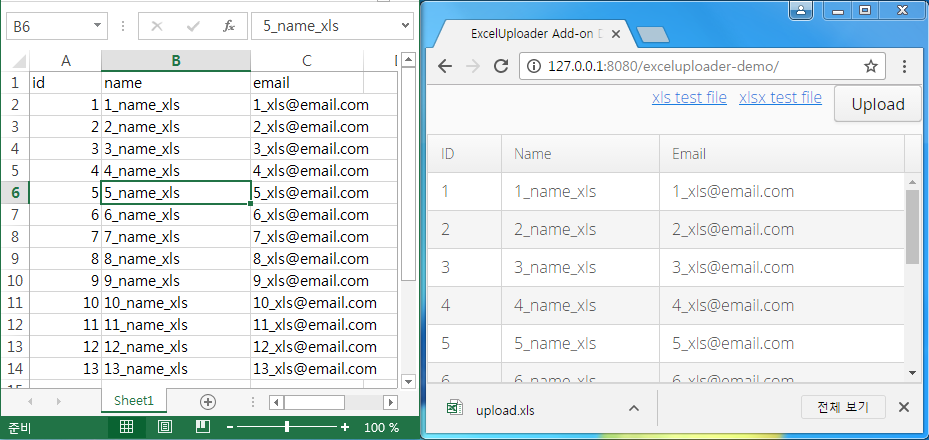

=  Excel Uploader Add-on for Vaadin

Excel Uploader is a UI component add-on for Vaadin.

== Excel Uploader Maven

[source,xml,indent=0]
----
<dependency>
	<groupId>com.vaadin.addon</groupId>
	<artifactId>excel-uploader</artifactId>
	<version>${project.version}</version>
</dependency>

<repository>
   <id>vaadin-addons</id>
   <url>http://maven.vaadin.com/vaadin-addons</url>
</repository>
----

== Excel Uploader Example Code

[source,java,indent=0]
----
final Table table = createTable(userList);
table.setSizeFull();
table.setContainerDataSource(new BeanItemContainer<>(User.class));
table.setVisibleColumns("id", "name","email");
table.setColumnHeaders("ID", "Name","Email");
table.setWidth(100, Unit.PERCENTAGE);
table.setSizeFull();

final ExcelUploader<User> excelUploader = new ExcelUploader<>(User.class);

final Upload upload = new Upload();
upload.setImmediate(true);
upload.setReceiver(excelUploader);
upload.setButtonCaption("Upload");
upload.addSucceededListener(excelUploader);
upload.addFinishedListener(new FinishedListener() {			
    @Override
    public void uploadFinished(FinishedEvent event) {
        List<User> users = excelUploader.uploadItems();
        table.removeAllItems();
        table.addItems(users);
    }
});
----

## Building and running demo

[source,groovy,indent=0]
----
mvn clean install
mvn -pl exceluploader-demo jetty:run
----

Demo Server : http://127.0.0.1:8080

== Building from source

requires Java SE 1.7.0_79+

requires Maven 3.3.9+

requires Tomcat 8.0.36+

requires Eclipse Mars.2 4.5.2+ 

requires Vaadin Framework 7.7.3+

== License & Author

Add-on is distributed under Apache License 2.0. For license terms, see LICENSE.txt.

