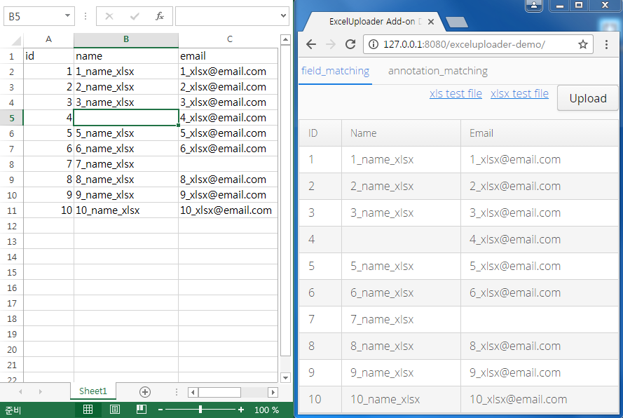
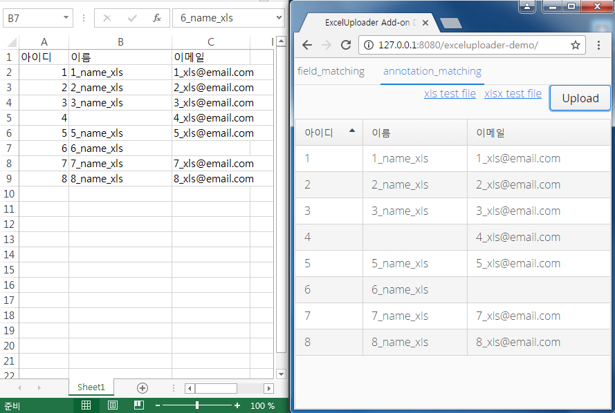

=  Excel Uploader Add-on for Vaadin

Excel Uploader is a UI component add-on for Vaadin.

== Excel Uploader Maven

[source,xml,indent=0]
----
<dependency>
	<groupId>com.vaadin.addon</groupId>
	<artifactId>excel-uploader</artifactId>
	<version>${project.version}</version>
</dependency>

<repository>
   <id>vaadin-addons</id>
   <url>http://maven.vaadin.com/vaadin-addons</url>
</repository>
----

== FieldName Type Excel Uploader Example Code

[source,java,indent=0]
----
public class User  implements Serializable {
    private Long id;
    private String email;
    private String name;
//....

final Table table = new Table();
table.setSizeFull();
table.setContainerDataSource(new BeanItemContainer<>(User.class, null));
table.setVisibleColumns("id", "name","email");
table.setColumnHeaders("ID", "Name","Email");

final ExcelUploader<User> excelUploader = new ExcelUploader<>(User.class);
excelUploader.addSucceededListener(new ExcelUploaderSucceededListener<User>() {
    @Override
    public void succeededListener(SucceededEvent event, List<User> items) {
        if(items.size()>0) {
            table.removeAllItems();
            table.addItems(items);
        }
    }
});

final Upload upload = new Upload();
upload.setImmediate(true);
upload.setButtonCaption("Upload");
upload.setReceiver(excelUploader);
upload.addSucceededListener(excelUploader);
----

== Annotation Type Excel Uploader Example Code

[source,java,indent=0]
----
public class UserEx implements Serializable {
    @ExcelColumn("아이디")
    private Long id;
    
    @ExcelColumn("이메일")
    private String email;
    
    @ExcelColumn("이름")
    private String name;
//....

final Table table = new Table();
table.setSizeFull();
table.setContainerDataSource(new BeanItemContainer<>(UserEx.class, null));
table.setVisibleColumns("id", "name","email");
table.setColumnHeaders("아이디", "이름","이메일");
		
final ExcelUploader<UserEx> excelUploader = new ExcelUploader<>(UserEx.class);
excelUploader.addSucceededListener(new ExcelUploaderSucceededListener<UserEx>() {
    @Override
    public void succeededListener(SucceededEvent event, List<UserEx> items) {
        if(items.size()>0) {
            table.removeAllItems();
            table.addItems(items);
       }
   }
});
		
final Upload upload = new Upload();
upload.setImmediate(true);
upload.setButtonCaption("Upload");
upload.setReceiver(excelUploader);
upload.addSucceededListener(excelUploader);
----

== AbstractExcelUploader Extension

[source,java,indent=0]
----
public class ExcelUploader<T> extends AbstractExcelUploader {

    @Override
    protected Field findColumnField(Class targetClass, String columnName) throws NoSuchFieldException { }
    
    @Override
    protected void setColumnField(Object object, Field field, String columnValue) throws IllegalAccessException { }
    
}
----

## Building and running demo

[source,groovy,indent=0]
----
mvn clean install
mvn -pl exceluploader-demo jetty:run
----

Demo Server : http://127.0.0.1:8080

== Building from source

requires Java SE 1.7.0_79+

requires Maven 3.3.9+

requires Tomcat 8.0.36+

requires Eclipse Mars.2 4.5.2+ 

requires Vaadin Framework 7.7.3+

== License & Author

Add-on is distributed under Apache License 2.0. For license terms, see LICENSE.txt.

